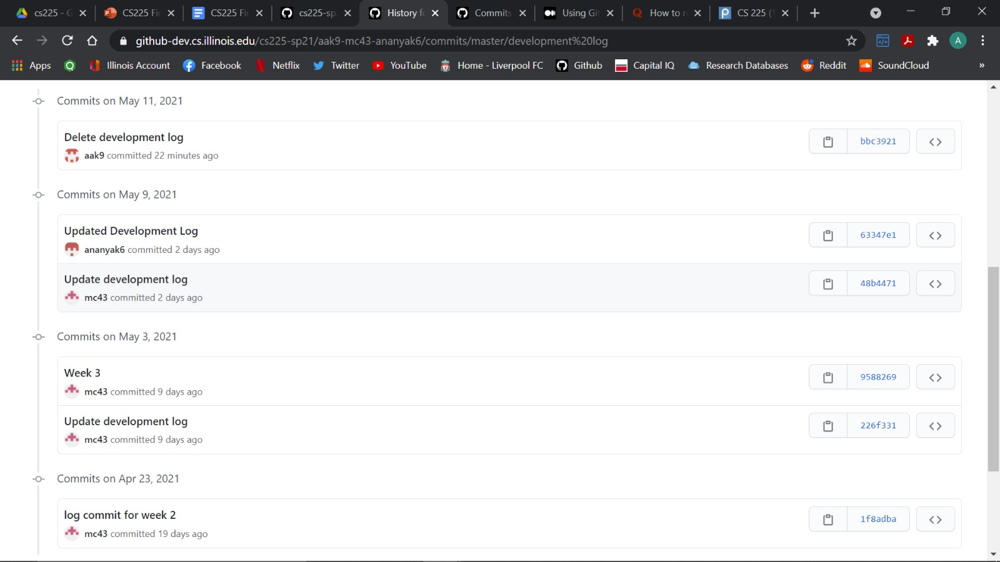

# aak9-mc43-ananyak6
# CS225 Final Project

## Team Members: Chung Minkyung, Ananya Kulkarni, Abbas Ali Khan ##

## Presentation of the Project ##
https://www.youtube.com/watch?v=4t1lQN1NE2I

## Dataset Used ##
We used the dataset that was created by gathering data from Amazon Users. The data is based on products that are frequently bought with each other. Studying this data will help us work out an algorithm to recommend users popular products and even suggest other products that are co-bought with it.
In our dataset, for instance, if a product with the ID '1' is frequently bought with another product of ID '2', the graph will have an edge from 1 to 2. Hence, our dataset is a directed graph. The dataset has two columns and to represent an edge from 1 to 2, the first column will contain the ID 1 and the second column will contain the ID of 2. The first column will also contain IDs in ascending order which means that the last node will be at the bottom of the dataset.

The dataset contains 262111 Nodes and 1234877 Edges.
Link to the Dataset :
http://snap.stanford.edu/data/amazon0302.html

## Important Code Locations ##
**1) Algorithms:**  The .h and .cpp files for the three algorithms (Dijsktra, BFS, and Betweenness Centrality) can be found under code/Algorithms.

**2) Test cases:** The tests.cpp file can be found under code/tests, and can be run using the following command in the terminal - make test && ./test

## How to use the Terminal: ##

The user must enter the following command first - make main2 && ./main2. 
 User must first enter the path to the dataset that they want to use.
ex) Datasets/dataset.txt

Every Product has an ID. Hence the user is first prompted to enter the ID of their first product. If the Product ID is valid, they will then be prompted for the ID of their second product.
ex) 3

If the Product ID inserted is not valid (as in a number is entered that is not in the range of the size of the dataset), they will be asked to check if they are entering the right ID and will be exited from the program.
ex) 5

Once both the Product IDs have been entered, the user will see a list of algorithms that they can choose to run on their products. The list offers the options:
1. Dijkstra's Algorithm
2. Breadth First Search
3. Betweenness Centrality
4. Return to re-enter Product ID

The user must enter one of the number 1-4. Upon selecting the number the program will perform the desired task.

The Dijkstra's Algorithm returns the shortest path between Product 1 and Product 2.
The Breadth First Search returns the shortest distance between Product 1 and Product 2.
The Betweenness Centrality returns the Centrality of Product 1.

The user can keep running any of these as many times as they want to. If they want to exit and re enter different Product IDs, they would select option 4, which will get them to exit the program.

## Development Log: ##
While working on our final project, we accidentally deleted the Development log, which we had been updating regularly every week. However, we did not know how to retrieve the old Development Log. But if you notice our old commits, you can see all the changes we had been making to the Development log.

